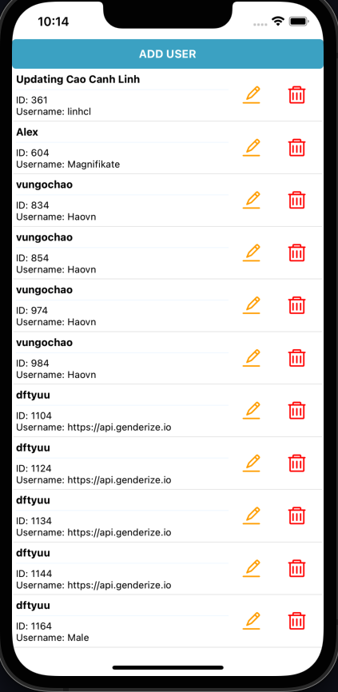

# React Native Demo App

Manage users by CRUD function

## Features

- Show list of users
- Create a new User
- Update name of user
- Delete a user

## Tech

- React native
- React redux
- Axios
- Thunk

## Installation

```sh
cd project
npm i or yarn
```

## Run App on IOS emulator

```sh
yarn ios
yarnn start
```

## Demo Image

### Show list user


### Create User


### Update User


### Delete User
